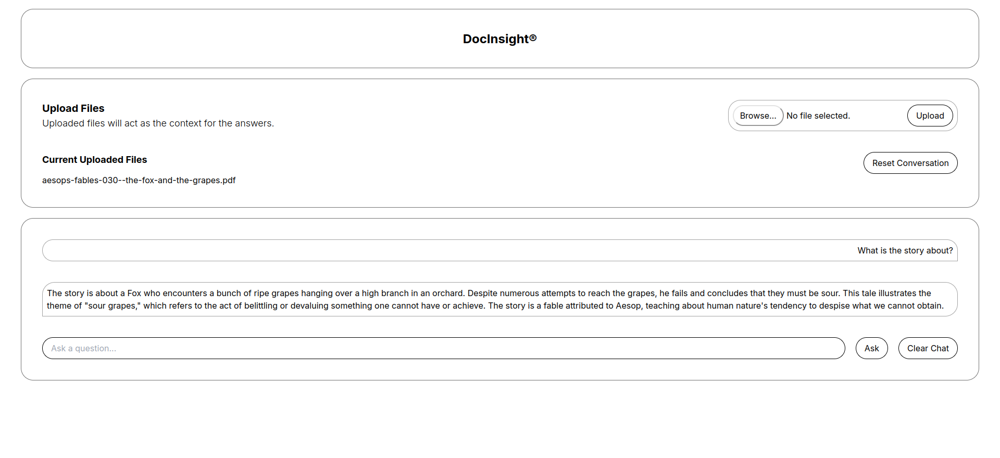

# DocInsight: A Local LLM-Based Retrieval-Augmented Generation System with Session-Based Chat History for PDF Document Querying

This project is a web-based chatbot interface that allows users to upload documents which then act as the context for the chatbot's responses. Built with React on the frontend and Python on the backend, it features a minimalistic user interface where users can interact with the chatbot and upload PDF documents. The backend is powered by Flask and utilizes the LangChain library for processing and retrieving information from the uploaded documents. The chatbot uses local LLM models to generate responses based on the document context.



## Features

- **React Frontend**: A clean and responsive UI built with React for interacting with the chatbot and uploading documents.
- **Document Upload**: Users can upload PDF documents that the chatbot uses as context for its answers.
- **Chat Interface**: A chat interface where users can ask questions and receive answers from the chatbot, with the context of the uploaded documents taken into consideration.
- **Flask Backend**: A Flask server handles API requests for uploading documents, fetching uploaded documents, and resetting the conversation.
- **Document Context Processing**: Utilizes LangChain for processing uploaded documents and generating responses based on the document context.
- **Local LLM Models**: Use any local LLM models for generating responses based on the document context, providing more accurate and context-aware answers with Ollama.
- **Session-Based Chat History**: The chatbot maintains a session-based chat history to provide more context-aware responses based on the conversation.

## Getting Started

### Prerequisites

- Node.js
- Python 3
- Flask
- LangChain
- Ollama

### Ollama Setup

1. Make sure you have Ollama installed on your system. For more information on how to install Ollama, refer to the [official documentation](https://github.com/ollama/ollama/blob/main/README.md#quickstart).

2. The model that has been used in this project is `mistral`, which can be downloaded using the following command:
 ```sh
   ollama pull mistral
   ```    
Or else you can choose your own model and make the necessary changes in the `server/main.py` file.

### Installation

1. Clone the repository:
   ```sh
   git clone https://github.com/shounakpaul/DocInsight.git
   ```
2. Install NPM packages:
   ```sh
   cd DocInsight
   npm install
   ```
3. Install Python dependencies (it is preferred you create a virtual environment):
   ```sh
   pip install -r requirements.txt
   ```

### Running the Project

1. Start the Vite development server:
   ```sh
   npm run dev
   ```
2. In a separate terminal, start the Flask server:
   ```sh
   cd server
   python main.py
   ```

## Usage

After starting both the frontend and backend servers, navigate to `http://localhost:5173` in your web browser to access the chatbot interface. You can upload PDF documents using the "Upload Files" section and then start asking questions in the chat interface.

## Contributing

Contributions are what make the open-source community such an amazing place to learn, inspire, and create. Any contributions you make are **greatly appreciated**.

1. Fork the Project
2. Create your Feature Branch 
3. Commit your Changes 
4. Push to the Branch
5. Open a Pull Request

## License

Distributed under the MIT License. See `LICENSE` for more information.

## Acknowledgements

- [React](https://reactjs.org/)
- [Vite](https://vitejs.dev/)
- [Flask](https://flask.palletsprojects.com/)
- [LangChain](https://github.com/LangChain/langchain)
- [Ollama](https://ollama.com/)
